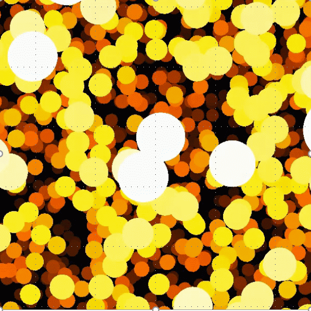

# Első házi feladat: Hiperbolikus geometria szerkesztő

A program a 600x600-as alkalmazói ablakot 4 nézetre bontja, amelyekben a hiperbolikus sík rendre Poincaré, Klein, Oldal- és Alulnézetben jelenik meg. Az egérgomb lenyomásával pontokat, fehér egyeneseket és fehér határú, türkisz kitöltésű köröket rajzolhatunk a hiperbolikus geometria szabályai szerint. Egy pont bármely nézetben megadható. A bal vagy jobb egérgomb lenyomására a kurzornak megfelelő hiperbolikus pontot egy verem tetejére kell tenni. A jobb egérgomb lenyomásakor ezután megvizsgáljuk, hogy hány pont található a vermen. Egynél pontot, kettőnél illeszkedő egyenest, legalább háromnál az utolsó háromra illeszkedő kört rajzolunk. A felhasznált pontokat levesszük a veremről. A felhasznált pontokat pirossal, a vermen várakozókat kékkel rajzoljuk. A hiperbolikus sík a különböző nézetekben 0.5 intenzitású szürke szín.

[Házi 1](https://github.com/FokaKefir/SzamitogepesGrafikaBME/tree/main/hazi1)

# Második házi feladat: Az univerzum tágulásának vizualizációja

Vizualizáljon egy táguló univerzumot az [1, 20] millárd év időintervallumban. Az univerzumban 6000 [K] hőmérsékletű, 5∙10^5 [millió km] sugarú óriáscsillagok vannak egyenletesen eloszolva. A csillagok spektrumát kimértük és azt találtuk, hogy a 150 [nm]-ren zéró és minimális, 450 [nm]-ren 1 [kW/m2/st] és maximális, végül 1600 [nm]-ren 0.1 [kW/m2/st] és minimális. A Hubble állandó 0.1 [1/Milliárd év]. A távcsövünk látószöge 4 fokos, az rgb detektorok érzékenységet úgy állítottuk be, hogy az 1 milliárd éves kép legnagyobb luminanciájú pontjához a megjeleníthető maximális intenzitás ötszörösét rendelje (beégés). Az red detektor színillesztő függvényéről azt tudjuk, hogy 400 [nm]-ren zérus és lokális maximuma van, 500 [nm]-ren -0.2 és minimum, 600 [nm]-ren 2.5 globális maximum, 700 [nm]-en 0 lokális minimum. A green detektor 400 [nm]-en zérus lokális maximum, 450 [nm]-ren -0.1 minimum, 550 [nm]-ren 1.2 maximum, és 700 [nm]-ren 0 minimum. A blue detektor 400 [nm]-en zérus lokális minimummal, 460 [nm]-ren 1 maximummal, 520 [nm]-en 0 minimum.  A programot a 0-9 szám-billentyűkkel lehet vezérelni. Ezek értékét 2-vel szorozva azt az időt kapjuk, amelyre a szimuláció elvégzendő [milliárd év] skálán. A szimuláció során 100 olyan csillagot kell tekinteni, amelyek potenciálisan láthatók a távcsőből. A spektrumot és a színillesztő függvényeket a megadott mérési adatokból Hermite interpolációval kell kiterjeszteni.

[Házi 2](https://github.com/FokaKefir/SzamitogepesGrafikaBME/tree/main/hazi2)

# Harmadik házi feladat: Táncoló lánctalpak

A program egy tank két lánctalpát jeleníti meg, amelyeket két botkormánnyal (jobb: o/l, bal: q/a) lehet gyorsítani, illetve lassítani. A két lánctalp összetartozik, még ha a közöttük lévő tankot nem is kötelező megjeleníteni. A tank és a talpak a szokásos módon haladnak és fordulnak a talajon.  A talaj sík amelyen tetszőlegesen választott tereptárgyak állnak. Egy-egy lánctalp szemekből áll, amelyek egymástól állandó távolságot tartva mozognak.

[Házi 3](https://github.com/FokaKefir/SzamitogepesGrafikaBME/tree/main/hazi3)

