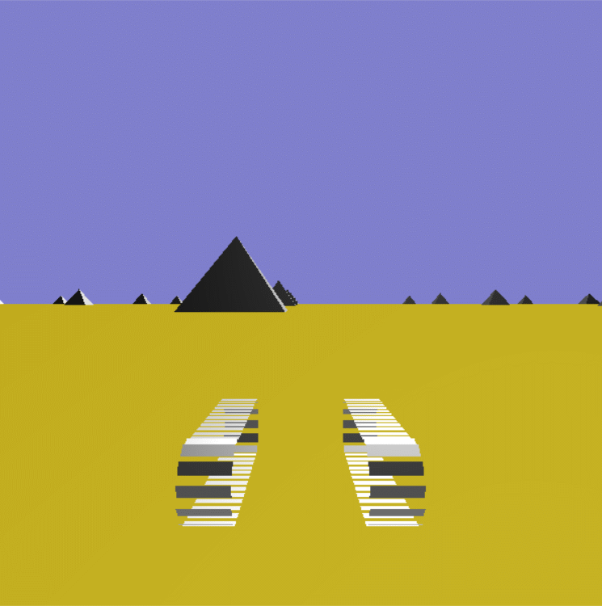

# Harmadik házi feladat: Táncoló lánctalpak

A program egy tank két lánctalpát jeleníti meg, amelyeket két botkormánnyal (jobb: o/l, bal: q/a) lehet gyorsítani, illetve lassítani. A két lánctalp összetartozik, még ha a közöttük lévő tankot nem is kötelező megjeleníteni. A tank és a talpak a szokásos módon haladnak és fordulnak a talajon.  A talaj sík amelyen tetszőlegesen választott tereptárgyak állnak. Egy-egy lánctalp szemekből áll, amelyek egymástól állandó távolságot tartva mozognak.

